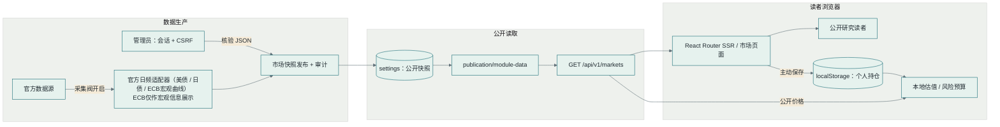
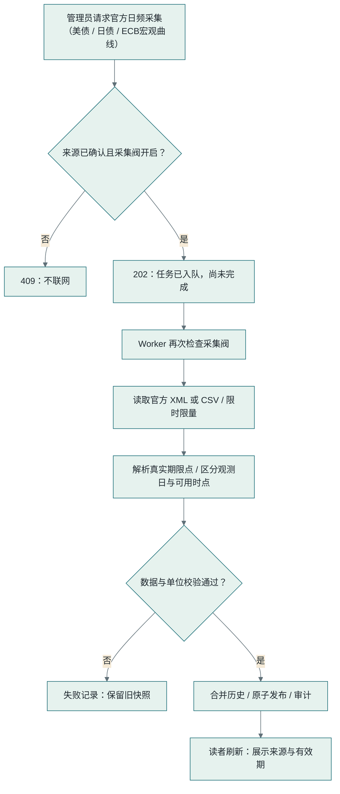
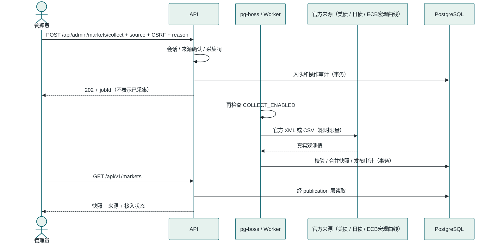
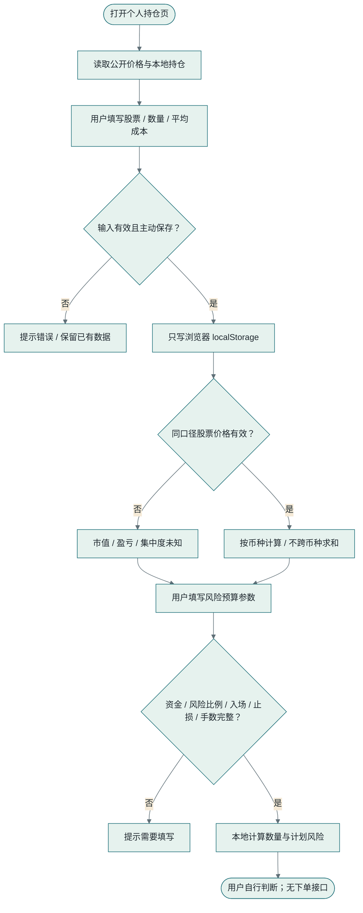
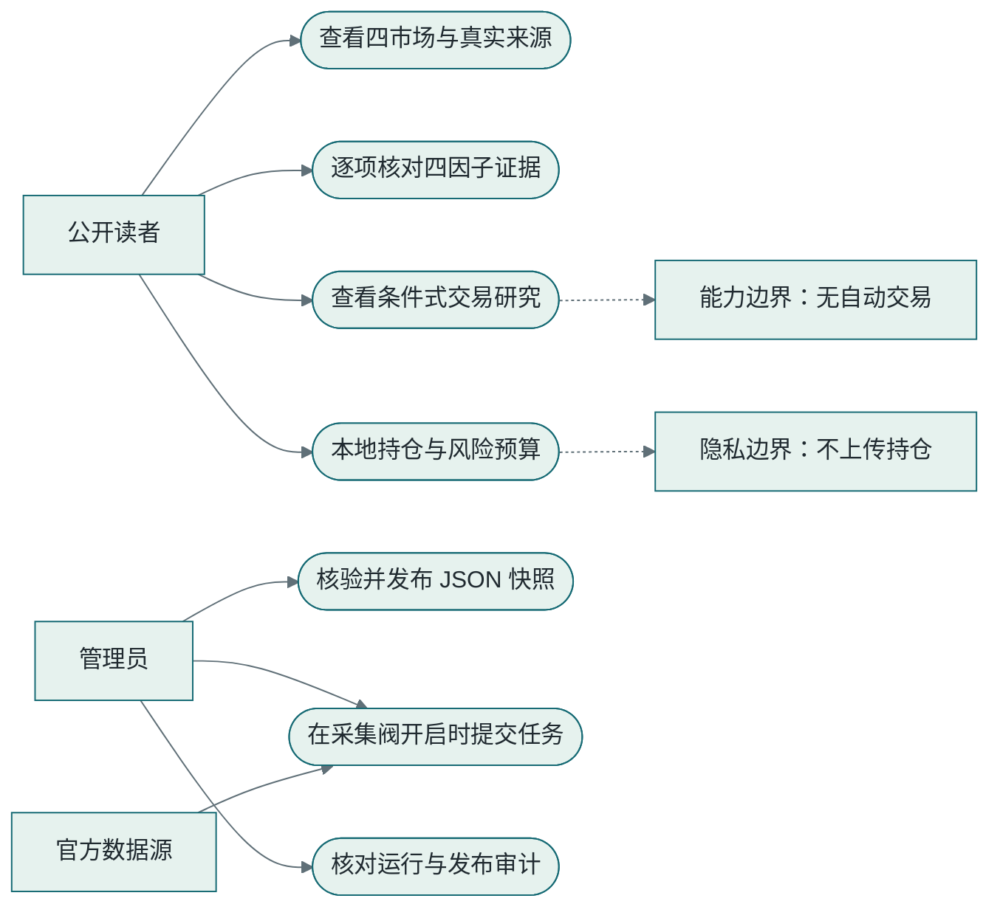
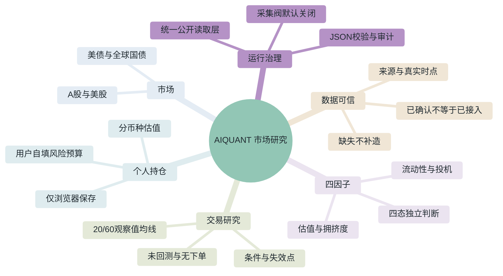

# 项目图表汇总

> 本文件由 ai-dev-workflow 自动维护。每次开发任务完成后，新增一组图表记录，
> 包含：架构图、核心业务流程图、时序图、活动图、用例图、思维导图。
> 对应的 PNG 导出文件位于 `docs/diagrams/` 目录下。

本组描述 `modules/markets/` 的实际实现。公开行情与个人持仓分开：市场数据走统一公开读取层，个人数量与成本仅保存在浏览器。来源获确认不代表已接入，缺失数据不生成曲线或结论。均线是未回测观察，系统不执行交易。

## 系统架构图 - 2026-10-06 / AIQUANT 市场研究

[PNG](diagrams/architecture-2026-10-06.png) · [Mermaid 源码](diagrams/architecture-2026-10-06.mmd) · [draw.io 可编辑文件](diagrams/architecture-2026-10-06.drawio)

## 核心业务流程图 - 2026-10-06 / AIQUANT 市场研究

[PNG](diagrams/business-flow-2026-10-06.png) · [Mermaid 源码](diagrams/business-flow-2026-10-06.mmd) · [draw.io 可编辑文件](diagrams/business-flow-2026-10-06.drawio)

## 时序图 - 2026-10-06 / AIQUANT 市场研究

[PNG](diagrams/sequence-2026-10-06.png) · [Mermaid 源码](diagrams/sequence-2026-10-06.mmd) · [draw.io 可编辑文件](diagrams/sequence-2026-10-06.drawio)

## 活动图 - 2026-10-06 / AIQUANT 市场研究

[PNG](diagrams/activity-2026-10-06.png) · [Mermaid 源码](diagrams/activity-2026-10-06.mmd) · [draw.io 可编辑文件](diagrams/activity-2026-10-06.drawio)

## 用例图 - 2026-10-06 / AIQUANT 市场研究

[PNG](diagrams/use-cases-2026-10-06.png) · [Mermaid 源码](diagrams/use-cases-2026-10-06.mmd) · [draw.io 可编辑文件](diagrams/use-cases-2026-10-06.drawio)

## 思维导图 - 2026-10-06 / AIQUANT 市场研究

[PNG](diagrams/mindmap-2026-10-06.png) · [Mermaid 源码](diagrams/mindmap-2026-10-06.mmd) · [draw.io 可编辑文件](diagrams/mindmap-2026-10-06.drawio)
